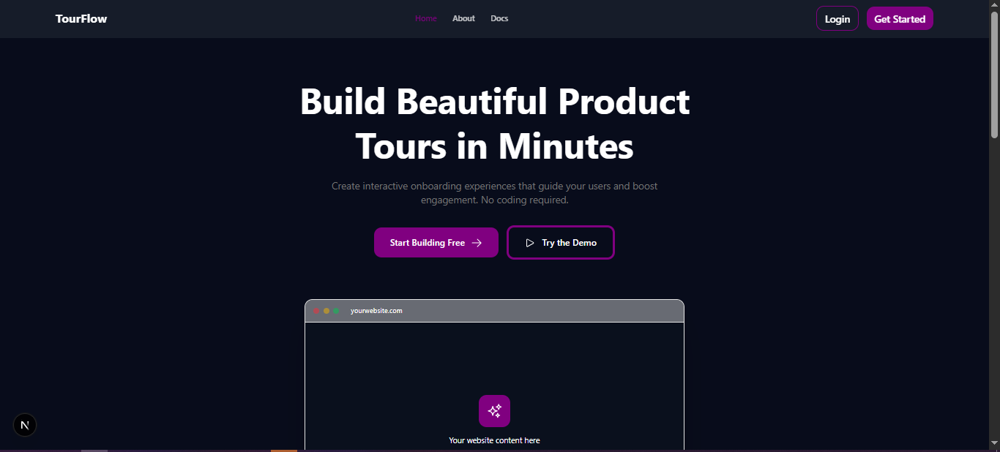

# TourFlow System
An embeddable onboarding/tour web application built with Next.js that allows website owners to create guided multi-step tours for their users. Create, customize, and deploy interactive product tours with ease.



## 🌟 Features

- **📊 Dashboard**: Create, edit, and manage onboarding tours
- **🎨 External Pages**: Beautiful landing page and documentation
- **🔧 Embeddable Widget**: Lightweight script that can be embedded on any website
- **🔐 Authentication**: Secure user authentication with Supabase
- **📈 Analytics**: Track tour completion rates and user engagement
- **⚡ Real-time Updates**: Instant synchronization across all components
- **📱 Responsive Design**: Works seamlessly on desktop and mobile devices

## 🚀 Live Demo

- **Landing Page**: [https://tourflow.vercel.app](https://tourflow.vercel.app)
- **Dashboard**: [https://tourflow.vercel.app/dashboard](https://tourflow.vercel.app/dashboard)
- **Documentation**: [https://tourflow.vercel.app/docs](https://tourflow.vercel.app/docs)

## 👥 Team Members

| Name | Role | GitHub | Focus Area |
|------|------|--------|------------|
| [Team Member 1] | Frontend Developer | [@username1](https://github.com/michycipher) | Auth | Dashboard
| BIGJESUS | Frontend Developer | [@username2](https://github.com/beejayofgod) | Dashboard |
| PAGE | Frontend Developer | [@username3](https://github.com/lilbobb) | Embeddable Widget |
| TecGirlNextDoor | Frontend Developer | [@username4](https://github.com/Mmesoma-Constance) | External Pages |

## 🏗️ Project Structure

```
tourflow-system/
├── app/                          # Next.js App Router
│   ├── (auth)/                  # Authentication pages
│   │   ├── login/
│   │   └── signup/
│   ├── dashboard/               # Dashboard pages (protected)
│   │   ├── page.tsx            # Main dashboard
│   │   ├── tours/              # Tour management
│   │   └── analytics/          # Analytics view
│   ├── (landing)/              # External pages
│   │   ├── page.tsx            # Landing page
│   │   ├── about/              # About page
│   │   └── docs/               # Documentation
│   └── api/                    # API routes
├── components/
│   ├── dashboard/              # Dashboard components
│   ├── landing/                # Landing page components
│   └── ui/                     # Shared UI components
├── lib/
│   ├── supabase.ts            # Supabase client & functions
│   └── utils.ts               # Utility functions
├── public/
│   └── embed/                 # Embeddable widget files
├── types/
│   └── tour.ts                # TypeScript type definitions
└── README.md
```

## 🛠️ Tech Stack

### Frontend
- **Framework**: [Next.js 14](https://nextjs.org/) (App Router)
- **Language**: TypeScript
- **Styling**: Tailwind CSS
- **UI Components**: shadcn/ui
- **Animations**: Framer Motion / GSAP
- **State Management**: React Hooks

### Backend & Database
- **Authentication**: [Supabase Auth](https://supabase.com/auth)
- **Database**: PostgreSQL (via Supabase)
- **Storage**: Supabase Storage
- **Real-time**: Supabase Realtime

### Embeddable Widget
- **Build Tool**: Vite
- **Bundle**: Vanilla JS/TypeScript
- **3D Graphics**: Three.js (optional)
- **Styling**: Inline CSS / CSS-in-JS

### Deployment
- **Hosting**: Vercel
- **CI/CD**: GitHub Actions
- **Domain**: Custom domain (optional)

## 📦 Installation

### Prerequisites
- Node.js 18+ and npm/yarn/pnpm
- Git
- Supabase account

### Clone the Repository
```bash
git clone https://github.com/michycipher/tourflow-system
cd tourflow-system
```

### Install Dependencies
```bash
npm install
# or
yarn install
# or
pnpm install
```

### Environment Variables
Create a `.env.local` file in the root directory:

```env
# Supabase
NEXT_PUBLIC_SUPABASE_URL=your_supabase_url
NEXT_PUBLIC_SUPABASE_ANON_KEY=your_supabase_anon_key
SUPABASE_SERVICE_ROLE_KEY=your_service_role_key

# App URL
NEXT_PUBLIC_APP_URL=http://localhost:3000

# Widget URL (if deployed separately)
NEXT_PUBLIC_WIDGET_URL=https://your-widget-cdn.com
```

### Database Setup

1. Go to your Supabase project
2. Run the following SQL in the SQL Editor:

```sql
-- Create tours table
CREATE TABLE tours (
    id UUID PRIMARY KEY DEFAULT gen_random_uuid(),
    user_id UUID NOT NULL REFERENCES auth.users(id),
    title TEXT NOT NULL,
    description TEXT,
    status TEXT DEFAULT 'active' CHECK (status IN ('active', 'inactive')),
    total_steps INTEGER DEFAULT 0,
    created_at TIMESTAMP WITH TIME ZONE DEFAULT NOW(),
    updated_at TIMESTAMP WITH TIME ZONE DEFAULT NOW()
);

-- Create tour_steps table
CREATE TABLE tour_steps (
    id UUID PRIMARY KEY DEFAULT gen_random_uuid(),
    tour_id UUID NOT NULL REFERENCES tours(id) ON DELETE CASCADE,
    step_order INTEGER NOT NULL,
    title TEXT NOT NULL,
    description TEXT,
    target_element TEXT,
    created_at TIMESTAMP WITH TIME ZONE DEFAULT NOW(),
    updated_at TIMESTAMP WITH TIME ZONE DEFAULT NOW()
);

-- Enable Row Level Security
ALTER TABLE tours ENABLE ROW LEVEL SECURITY;
ALTER TABLE tour_steps ENABLE ROW LEVEL SECURITY;

-- Create policies for tours
CREATE POLICY "Users can create their own tours"
ON tours FOR INSERT
WITH CHECK (auth.uid() = user_id);

CREATE POLICY "Users can view their own tours"
ON tours FOR SELECT
USING (auth.uid() = user_id);

CREATE POLICY "Users can update their own tours"
ON tours FOR UPDATE
USING (auth.uid() = user_id);

CREATE POLICY "Users can delete their own tours"
ON tours FOR DELETE
USING (auth.uid() = user_id);

-- Create policies for tour_steps
CREATE POLICY "Users can manage steps for their own tours"
ON tour_steps FOR ALL
USING (
    EXISTS (
        SELECT 1 FROM tours
        WHERE tours.id = tour_steps.tour_id
        AND tours.user_id = auth.uid()
    )
);

-- Create indexes
CREATE INDEX idx_tours_user_id ON tours(user_id);
CREATE INDEX idx_tour_steps_tour_id ON tour_steps(tour_id);
CREATE INDEX idx_tour_steps_order ON tour_steps(tour_id, step_order);
```

### Run Development Server
```bash
npm run dev
# or
yarn dev
# or
pnpm dev
```

Open [http://localhost:3000](http://localhost:3000) in your browser.

## 🎯 Usage

### For Website Owners (Dashboard)

1. **Sign up** for an account
2. **Create a tour** with at least 5 steps
3. **Customize** each step with title, description, and target element
4. **Generate** embed code
5. **Copy** and paste the embed code into your website

### Embedding the Tour

Add this script to your website's `<head>` or before closing `</body>`:

```html
<!-- Add to your website -->
<script src="https://tourflow.vercel.app/embed/widget.js"></script>
<script>
  TourFlow.init({
    tourId: 'your-tour-id',
    apiKey: 'your-api-key',
    autoStart: true
  });
</script>
```

### For End Users

When visitors land on your website:
1. The tour **automatically appears** (if configured)
2. Users can **navigate** through steps (Next/Back)
3. Users can **skip** or **pause** the tour
4. Progress is **tracked** and sent to analytics

## 📊 Dashboard Features

### Tour Management
- ✅ Create new tours
- ✅ Edit tour title and description
- ✅ Add, edit, delete steps
- ✅ Reorder steps with drag & drop
- ✅ Activate/deactivate tours
- ✅ Preview tours before publishing

### Analytics (Coming Soon)
- 📈 Total tours started
- 📈 Completion rates
- 📈 Drop-off points
- 📈 Average time per step

## 🎨 Embeddable Widget Features

- **Minimal footprint**: < 50KB gzipped
- **No dependencies**: Pure vanilla JS
- **Customizable**: Themes and positioning
- **Responsive**: Works on all screen sizes
- **Accessible**: WCAG 2.1 compliant
- **Fast loading**: Async script loading

### Widget Configuration Options

```javascript
TourFlow.init({
  tourId: 'uuid',              // Required: Tour ID from dashboard
  apiKey: 'your-key',          // Required: API key
  autoStart: true,             // Auto-start tour on page load
  showOnce: false,             // Show only once per user
  theme: 'light',              // 'light' | 'dark' | 'auto'
  position: 'center',          // 'center' | 'top' | 'bottom'
  showAvatar: true,            // Show 3D avatar (optional)
  onComplete: () => {},        // Callback when tour completes
  onSkip: () => {},            // Callback when user skips
  onStepChange: (step) => {},  // Callback on step change
});
```

## 🧪 Testing

```bash
# Run tests
npm run test

# Run tests in watch mode
npm run test:watch

# Run E2E tests
npm run test:e2e
```

## 📝 API Documentation

### Create Tour
```typescript
POST /api/tours
{
  "title": "Welcome Tour",
  "description": "Get started with our app",
  "steps": [...]
}
```

### Get User Tours
```typescript
GET /api/tours
```

### Update Tour
```typescript
PATCH /api/tours/:id
{
  "title": "Updated Title",
  "description": "Updated description"
}
```

### Delete Tour
```typescript
DELETE /api/tours/:id
```

## 🚀 Deployment

### Deploy to Vercel

[](https://vercel.com/new/clone?repository-url=https://github.com/your-org/tourflow-system)

Or manually:

```bash
# Install Vercel CLI
npm i -g vercel

# Deploy
vercel

# Deploy to production
vercel --prod
```

### Environment Variables on Vercel

Add all environment variables from `.env.local` to your Vercel project settings.

## 🤝 Contributing

We welcome contributions! Please follow these steps:

1. Fork the repository
2. Create your feature branch (`git checkout -b feature/AmazingFeature`)
3. Commit your changes (`git commit -m 'Add some AmazingFeature'`)
4. Push to the branch (`git push origin feature/AmazingFeature`)
5. Open a Pull Request

### Commit Convention
- `feat`: New feature
- `fix`: Bug fix
- `docs`: Documentation changes
- `style`: Code style changes (formatting, etc.)
- `refactor`: Code refactoring
- `test`: Adding tests
- `chore`: Maintenance tasks

## 📄 License

This project is licensed under the MIT License - see the [LICENSE](LICENSE) file for details.

## 🙏 Acknowledgments

- [Next.js](https://nextjs.org/) - The React Framework
- [Supabase](https://supabase.com/) - Open source Firebase alternative
- [shadcn/ui](https://ui.shadcn.com/) - Re-usable components
- [Tailwind CSS](https://tailwindcss.com/) - Utility-first CSS framework
- [Vercel](https://vercel.com/) - Deployment platform

## 📞 Support

- **Documentation**: [https://tourflow.vercel.app/docs](https://tourflow.vercel.app/docs)
- **Email**: support@tourflow.com

## 🗺️ Roadmap

- [x] Basic tour creation and management
- [x] Authentication system
- [x] Embeddable widget
- [ ] Advanced analytics dashboard
- [ ] A/B testing for tours
- [ ] Multi-language support
- [ ] Tour templates library
- [ ] Integration with popular CMS platforms


---

**Built with ❤️ by the TourFlow Team** | HNG Internship Stage 8 Project

**⭐ Star this repo if you find it helpful!**
